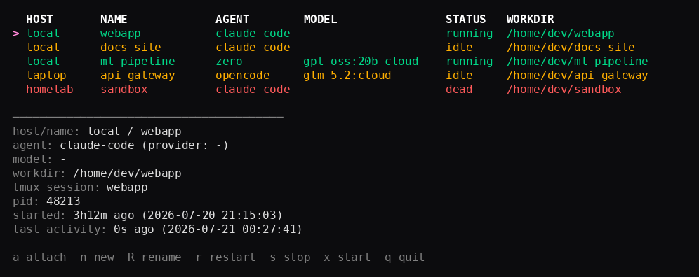
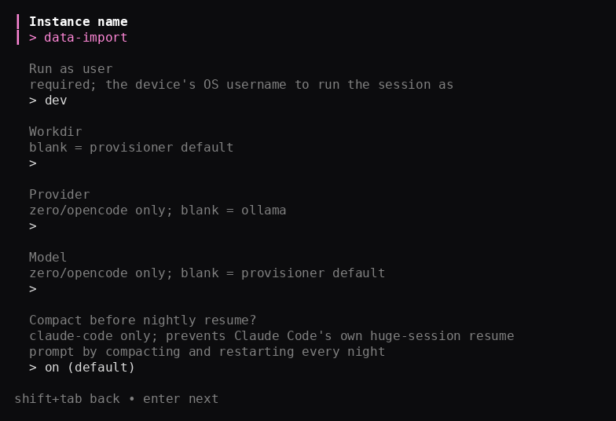

# agentmux

Agents that are remote controlled, persistent, redundant and self-maintained.

The idea: coding-agent CLIs (Claude Code, [opencode](https://opencode.ai),
[Zero](https://github.com/Gitlawb/zero), and whatever comes next) are most
useful when there's always a live session you can drop into from anywhere —
not just while a terminal happens to be open. agentmux keeps one running per
backend, brings it back after a reboot, and keeps the CLI itself up to date
without you babysitting it.

## agentmux CLI

`agentmux` is a single self-contained binary: a background daemon, a TUI to
see and control every instance across every machine you run it on, and a
wizard for creating new ones. This is the recommended way to run agentmux —
no bash installers to run by hand.

<p align="center">
  
  
</p>

```sh
git clone https://github.com/m-rk/agentmux.git
cd agentmux/daemon
go build -o agentmux ./cmd/agentmux

sudo ./agentmux daemon install   # Linux: installs a systemd unit
./agentmux daemon install        # macOS: installs a per-user LaunchAgent, no sudo

./agentmux new                   # wizard: pick device, agent, model, workdir
./agentmux                       # TUI: attach, rename, restart, create — across every host
```

- **One binary, no bash** — `agentmux new` provisions `claude-code`, `zero`,
  and `opencode` instances end to end (registry file, systemd
  unit/LaunchAgent, tmux session) on Linux or macOS. `agentmux new -y ...`
  does the same non-interactively, for scripting.
- **Multi-host** — list other machines in `~/.config/agentmux/hosts.yaml`
  (e.g. reachable over Tailscale) and the TUI dials all of them at once,
  merged into one table.
- **Rename in place** — `agentmux rename` (or `R` in the TUI) renames an
  instance's tmux session and/or Claude Code Remote Control display name
  without losing the session.
- **Resume lookup** — `agentmux resume-list` shows what Claude Code sessions
  are resumable for a workdir; the wizard offers the same as a picker.
- **Compact-before-resume** — every nightly update compacts and restarts a
  Claude Code session (configurable per instance) so a long-running,
  unattended session never gets stuck behind Claude Code's own "resume from
  a huge session summary?" prompt.

See [`daemon/README.md`](daemon/README.md) to build and run it, and
[`docs/design/daemon-tui.md`](docs/design/daemon-tui.md) for the full design.

## Four properties

Every backend here aims for:

- **Persistence** — the session lives in `tmux`, detached, so SSH drops and
  network blips don't kill it.
- **Remote access** — reattach from anywhere (`tmux attach`, the `agentmux`
  TUI, or a backend's own remote-control feature if it has one).
- **Self-maintenance** — a scheduled job updates the CLI and restarts the
  session only when needed, so it doesn't go stale.
- **Redundancy** — running more than one backend side by side on the same
  box (different CLIs, different model providers) so an outage or degraded
  provider doesn't take out your only agent, and gives you a choice of
  agent/model for the task at hand.

## Manual install (no daemon)

`agentmux new` creates instances through a running agentmux daemon. If you
only need local instances and don't want the daemon or TUI, the installer
scripts below provide the equivalent host-supervisor setup directly.

| Installer | Agent CLIs | Provider configuration | Linux | macOS |
|---|---|---|---|---|
| [`backends/agentmux`](backends/agentmux) | `zero`, `opencode` | Ollama | systemd | LaunchAgents |
| [`backends/claude-code`](backends/claude-code) | Claude Code | Managed by Claude Code | systemd | LaunchAgents |

`backends/agentmux` is the more general of the two: one named instance
combines an agent CLI, a model provider, a model, a workdir, and host
supervisor wiring, so new agents/providers/models can be mixed without
cloning whole directories. `backends/claude-code` is a dedicated installer
predating that generalization, kept for its Remote Control-specific
defaults.

### Quickstart (configurable backend)

#### macOS

```sh
# one-time, manual:
brew install tmux ollama
brew services start ollama
ollama signin
npm install -g @gitlawb/zero

git clone https://github.com/m-rk/agentmux.git
cd agentmux/backends/agentmux
./install-macos.sh \
  --instance work-zero \
  --agent zero \
  --provider ollama \
  --model gpt-oss:20b-cloud \
  --yes
```

This creates `com.agentmux.work-zero` and
`com.agentmux.work-zero.update` LaunchAgents, plus a dedicated workdir at
`~/.agentmux/work-zero`. Reattach with:

```sh
tmux -L agentmux-work-zero attach -t work-zero
```

Use another instance name, agent, model, or workdir to run multiple agentmux
instances side by side on the same machine.

#### Linux systemd

```sh
git clone https://github.com/m-rk/agentmux.git
cd agentmux/backends/agentmux
sudo ./install.sh \
  --instance work-zero \
  --agent zero \
  --provider ollama \
  --model gpt-oss:20b-cloud
```

See [`backends/agentmux`](backends/agentmux) for supported agent/provider
combinations and all install flags.

### Quickstart (Claude Code backend)

#### macOS

```sh
git clone https://github.com/m-rk/agentmux.git
cd agentmux/backends/claude-code
./install-macos.sh
```

When run from a terminal, the installer prompts for the tmux session name,
Claude display name, update time, final confirmation, and whether to attach
to the tmux session immediately. The default tmux name is
`<machine-slug>-claude-YYYY-MM-DD`; the default display name is
`<user>:<host> 🤹 <workdir-basename>`. For unattended installs, pass flags
instead:

```sh
./install-macos.sh \
  --tmux-session work-claude \
  --display-name "Work Claude" \
  --update-time 03:00 \
  --yes
```

Claude Code must already be authenticated: run `claude` once and complete
login before installing. The installer verifies authentication and
pre-accepts workspace trust for the configured workdir. Add `--attach` to
enter the tmux session immediately after installing.

Use `./install-macos.sh --plan` to preview the LaunchAgents and settings
without writing files. A normal install creates two user LaunchAgents,
without `sudo`:

- `com.agentmux.claude-code` runs `rc-start.sh` at login and every five
  minutes by default, creating the tmux session if it is missing.
- `com.agentmux.claude-code.update` runs nightly at 03:00 local time by
  default, updates Claude Code, and restarts the tmux session only when the
  version changed.

Logs go to `~/Library/Logs/agentmux`. Reattach with
`tmux -L agentmux-<instance> attach -t <tmux-session>`, or from the Claude
Code mobile app via Remote Control.

Pass `--instance NAME` (default: `claude-code`) to install a second, third,
... instance side by side, each with its own workdir, tmux session, and
LaunchAgent/systemd names — see
[`backends/claude-code`](backends/claude-code#multiple-instances).

To remove the LaunchAgents: `./uninstall-macos.sh` (leaves any running tmux
session alone).

#### Linux systemd

```sh
git clone https://github.com/m-rk/agentmux.git
cd agentmux/backends/claude-code
sudo AGENTMUX_SESSION_NAME="my-session" \
     AGENTMUX_ON_CALENDAR="*-*-* 03:00:00 Australia/Perth" \
     ./install.sh
```

(`install.sh` also accepts flags, e.g. `--session-name`/`--on-calendar`, and
defaults the Remote Control display name to `<user>:<host> 🤹 <workdir-basename>`
— see [`backends/claude-code`](backends/claude-code) for the full list.)

This sets up two systemd units (running as whichever user invoked `sudo`,
override with `AGENTMUX_RUN_USER`):

- `agentmux-claude-code.service` — starts (and restarts, on boot) a `tmux`
  session named `$AGENTMUX_SESSION_NAME` running `claude --remote-control`
  in `~/.agentmux/claude-code`.
- `agentmux-claude-code-update.timer` — nightly (default 03:00 in the
  configured `Australia/Perth` timezone, override with
  `AGENTMUX_ON_CALENDAR`) checks for a new Claude Code version, and only
  restarts the session if one was installed.

Reattach any time with
`tmux -L agentmux-<instance> attach -t <tmux-session>`, or from the Claude
Code mobile app via Remote Control, where it appears under the configured
display name.

To remove: `sudo ./uninstall.sh` (leaves any running tmux session alone).

See [`backends/claude-code`](backends/claude-code) for the scripts,
LaunchAgent templates, and systemd unit templates.

## Tests

Run the lightweight regression harness:

```sh
tests/smoke.sh
```

By default it uses fake local tools for provider/agent checks, so it does not
need a running model provider. To include a real Ollama + Zero generation smoke:

```sh
AGENTMUX_LIVE_OLLAMA=1 tests/smoke.sh
```

To include a real Ollama + opencode generation smoke:

```sh
AGENTMUX_LIVE_OPENCODE=1 tests/smoke.sh
```

## Roadmap

- More backends (Codex CLI, Gemini CLI, whatever comes next) — each one
  running side by side adds to the redundancy/variety this repo is going
  for
- Health-check / notification on failed updates instead of just journal logs
- TLS/auth for the daemon's TCP listener, instead of relying solely on
  tailnet ACLs
