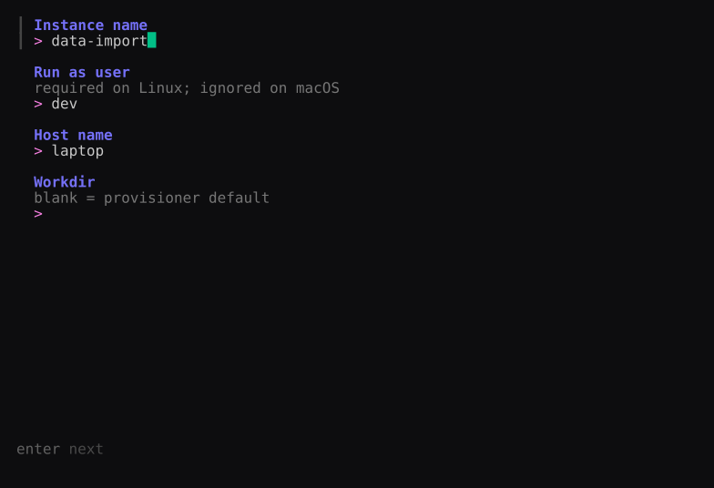

# agentmux

Agents that are remote controlled, persistent, redundant and self-maintained.

The idea: coding-agent CLIs (Claude Code, [Kilo](https://kilo.ai),
[opencode](https://opencode.ai), [Zero](https://github.com/Gitlawb/zero),
[Amp](https://ampcode.com), and
whatever comes next) are most useful when there's always a live session you
can drop into from anywhere — not just while a terminal happens to be open.
agentmux keeps one running per instance, brings it back after a reboot, and
keeps the CLI itself up to date without you babysitting it.

<p align="center">
  
</p>

## agentmux CLI

`agentmux` is one Go binary: a background daemon, a TUI to see and control
every instance across every machine you run it on, and a wizard for creating
new ones. This is the recommended way to run agentmux — no bash installers to
run by hand. It orchestrates `tmux` and the agent CLIs already installed on
the host; it doesn't bundle those tools itself.

<p align="center">
  
  
</p>

The wizard preview is generated from its real form code with fixed synthetic
data. See [deterministic UX screenshots](docs/design/ux-screenshots.md) to
regenerate every state or add another one.

The Linux daemon runs as root and the local API has no authentication yet —
see [Trust model](#trust-model). Only install where every local user is
trusted.

```sh
git clone https://github.com/m-rk/agentmux.git
cd agentmux/daemon
go build -o agentmux ./cmd/agentmux

sudo ./agentmux daemon install   # Linux: daemon + doctor systemd timer
./agentmux daemon install        # macOS: daemon + doctor LaunchAgent, no sudo

./agentmux new                   # agent-specific wizard: device, agent, relevant settings
./agentmux                       # TUI: attach, rename, restart, create — across every host
```

Building requires the Go toolchain pinned in `daemon/go.mod`. Each host also
needs `tmux`, the agent
CLI you plan to run, and whatever runtime, credentials, or network access your
selected model provider requires. agentmux checks those prerequisites but
leaves their installation and sign-in to you. The provider adapter included
for `zero`, `opencode`, and `kilo` today is Ollama; provider and model remain
separate parts of an instance rather than defining the backend itself.

### Supported agents

| Agent | Account & billing | Reach it from | Notes |
|---|---|---|---|
| `claude-code` | Your Claude account | Mobile app via Remote Control, or tmux/TUI | Wizard resume picker (`-resume`); nightly compact-before-resume |
| `zero`, `opencode` | Your provider: `-provider`/`-model` flags — self-hosted Ollama by default, or any OpenAI-compatible endpoint | tmux/TUI attach | Re-run `new -y` to change provider/model in place |
| `kilo` | Same provider model as zero/opencode, plus `-provider-api-key-env` for custom endpoints | Kilo remote relay, or tmux/TUI | Per-instance state isolation ([runbook](docs/kilo-xdg-isolation.md)) |
| `amp` | Your Amp account (`amp login`); takes no provider/model flags | Threads at ampcode.com land in the workdir; tmux/TUI | Runner id derived from the instance name (`site-amp` → `site`) |

Creating an `amp` instance preflights two things that fail badly later: the
run user must already be signed in, and the CLI must be installed via the
`@ampcode/cli` npm package rather than the `@sourcegraph/amp` wrapper its
self-updater cannot maintain. A stored `amp login` eventually expires; for
unattended runners, inject an access token from 1Password instead — see
[Headless amp auth](docs/amp-secrets.md).

### Four properties

Every backend here aims for:

- **Persistence** — the session lives in `tmux`, detached, so SSH drops and
  network blips don't kill it.
- **Remote access** — reattach from anywhere (`tmux attach`, the `agentmux`
  TUI, or a backend's own remote-control feature if it has one).
- **Self-maintenance** — a scheduled job updates the CLI and restarts the
  session according to that backend's maintenance policy, so it doesn't go
  stale.
- **Redundancy** — running more than one backend side by side on the same
  box (different CLIs, different model providers) so an outage or degraded
  provider doesn't take out your only agent, and gives you a choice of
  agent/model for the task at hand.

### Features

- **One binary, no installer scripts** — `agentmux new` provisions
  `claude-code`, `zero`, `opencode`, `kilo`, and `amp` instances end to end
  (registry file, systemd unit/LaunchAgent, tmux session) on Linux or macOS.
  `agentmux new -y ...` does the same non-interactively, for scripting.
- **Multi-host** — list other machines in `~/.config/agentmux/hosts.yaml`
  (e.g. reachable over Tailscale) and the TUI dials all of them at once,
  merged into one table.
- **Rename deliberately** — `agentmux rename` (or `R` in the TUI) changes a
  tmux session name live. Changing a Claude Code Remote Control display name
  requires a restart; see [Known limitations](#known-limitations) if keeping
  one exact transcript is important.
- **Headless view/send-keys** — `agentmux view -instance NAME` prints a
  read-only snapshot of a tmux pane and `agentmux send-keys` types into it,
  without attaching. See [AGENTS.md](AGENTS.md) for why this matters to
  coding agents driving other instances.
- **Resume lookup** — `agentmux resume-list` shows what Claude Code sessions
  are resumable for a workdir; the wizard offers the same as a picker.
- **Per-instance Kilo state** — prepared Kilo instances can keep their SQLite
  session database and process state under their own private agentmux
  directory while continuing to share global config and cache. Existing
  instances stay on their legacy shared paths until their migration is marked
  ready, so installing a new binary cannot silently log them out. See the
  [Kilo isolation runbook](docs/kilo-xdg-isolation.md).
- **Custom providers** — point a zero/opencode/kilo instance at any
  OpenAI-compatible endpoint, not just the built-in Ollama default, via
  `-provider`/`-provider-base-url` (and, for Kilo, `-provider-api-key-env`).
  Re-running `new -y` against an existing instance updates its
  provider/model in place. See
  [Custom providers](docs/custom-providers.md).
- **Compact-before-resume** — by default, nightly Claude Code maintenance
  compacts and restarts the session so a long-running unattended session
  doesn't get stuck behind Claude Code's own huge-session prompt. If the
  transcript already ends at a compact boundary, agentmux skips the redundant
  `/compact`. This is configurable per instance.
- **A doctor after refresh** — one host-wide check daily at 03:30 verifies
  every session and escalates troubled ones to Claude for bounded repair.
  See [Doctor](docs/doctor.md).
- **Thread watch** — an optional per-user service that follows each
  instance's own turns in near real time and pages Discord only when a
  session is stuck, waiting on you, or failing in a loop; everything else is
  logged for a nightly digest. See [Thread watch](docs/thread-watch.md).
- **Discord** — one outbound channel for everything agentmux needs to tell
  you: doctor findings and repairs plus Claude token-expiry warnings
  (`agentmux notify discord setup`), and cross-session collaboration through
  one shared forum. See
  [Discord collaboration](docs/discord-collaboration.md).

### Session doctor

One host-wide check runs daily at 03:30, after the 03:00 per-instance
refresh: deterministic probes first — no model called, nothing leaves the
host when healthy — then Claude escalation only for troubled sessions, with
repairs and notable findings reported to Discord. See
[Doctor](docs/doctor.md), or run it anytime with
`agentmux doctor -dry-run`.

### Thread watch

Thread watch is an optional per-user service that follows each instance's
own turns — the same JSONL/log/SQLite records Claude Code, amp, and opencode
already keep for themselves — and tells you when a session needs you.
**Intervene alerts** page Discord right away, and only when a human action
would change the outcome: the session is waiting on you, stuck, or failing
in a loop. Everything else (a slow turn, a recovered error, wasted tokens)
is only logged as an **insight**, rolling up into at most one **nightly
digest**. Jev, TypeSafe's System One model, is an optional gate on top of
the deterministic rules — it runs in shadow mode by default, scoring
intervene candidates without ever suppressing one, until you trust it
enough to switch to `live`.

```sh
sudo agentmux threadwatch install -run-user YOUR_USER  # per host, as your own user
agentmux threadwatch jev-test                           # optional: check a configured TypeSafe key
sudo agentmux threadwatch review install [-at 07:00]     # optional: nightly digest timer
```

The TypeSafe key is entirely optional and set per agentmux install (i.e. per
host) in `~/.config/agentmux/threadwatch.yaml`, either as a 1Password
reference (`jev.api_key_ref`) or a literal key in a mode-600 file
(`jev.api_key`). Without one, thread watch runs on its deterministic rules
alone.

An intervene alert, rendered by `threadwatch.FormatAlert` (synthetic data):

```
⏳ webapp · 3f2a9c1e on devbox
waiting on the user for 12m with no reply
Waiting: question_to_user
> I've migrated the settings page and the tests pass. The old form also backs the admin page. Should I migrate that too, or leave it for a separate change?
Attach: `agentmux` → select webapp → a
```

A nightly digest, rendered by `threadwatch.FormatDigest` (synthetic data):

```
🧭 agentmux daily review on devbox
60 turn(s) · 2 alert(s) sent · slowest: webapp (p90 6m0s)
• flaky test x5 on webapp — pin the flaky integration test or add a retry (webapp)
• missing permission x3 on api — add an allow-rule for the blocked tool to AGENTS.md (api)
```

See [Thread watch](docs/thread-watch.md) for the full operator guide
(install, config, the TypeSafe key, and the nightly review) and
[docs/design/thread-watch.md](docs/design/thread-watch.md) for the design.

## Trust model

agentmux is currently intended for a single user, or for a host and tailnet
where every client is trusted as an administrator. The API is not an
authentication boundary yet:

- The Linux daemon runs as root so it can manage systemd units. Native Linux
  provisioning creates an absolute workdir *as the requested run user*; it
  never chowns an existing caller-chosen path or creates one with root's
  filesystem permissions.
- The local Unix socket is currently mode `0666`, and the optional TCP listener
  has no authentication or TLS. Anyone who can reach either endpoint can list,
  create, control, view, attach to, and type into instances. Don't expose the
  TCP listener beyond tightly restricted, fully trusted devices.

Authentication and tighter local socket permissions are active hardening work,
not properties the README quietly assumes already exist.

See [`daemon/README.md`](daemon/README.md) to build and run it, and
[`docs/design/daemon-tui.md`](docs/design/daemon-tui.md) for the full design.

## Manual install (no daemon)

`agentmux new` creates instances through a running agentmux daemon. If you
only need local instances and don't want the daemon or TUI, the installer
scripts below provide the same basic host-supervisor shape directly. They are
not exact feature equivalents: in particular, the native daemon path has
Kilo session resume and remote-relay setup that the manual scripts do not,
and there is no manual installer for `amp` — amp runners are daemon-only
(`agentmux new`).

| Installer | Agent CLIs | Included provider adapter | Linux | macOS |
|---|---|---|---|---|
| [`backends/agentmux`](backends/agentmux) | `zero`, `opencode`, `kilo` | Ollama (today) | systemd | LaunchAgents |
| [`backends/claude-code`](backends/claude-code) | Claude Code | Managed by Claude Code | systemd | LaunchAgents |

`backends/agentmux` is the more general of the two: one named instance
combines an agent CLI, a model provider, a model, a workdir, and host
supervisor wiring, so new agents/providers/models can be mixed without
cloning whole directories. `backends/claude-code` is a dedicated installer
predating that generalization, kept for its Remote Control-specific
defaults. Their examples use Ollama because it is the provider
adapter currently included in the repository, not because the configurable
backend is inherently tied to it.

Worked install commands for both backends live in their own READMEs —
[`backends/agentmux`](backends/agentmux#macos) (Zero + Ollama example) and
[`backends/claude-code`](backends/claude-code#macos) — including flags,
multi-instance setups, and unit templates.

### Removing instances and agentmux

Manual installs remove per instance — each backend README documents its own
removal (`uninstall-macos.sh` / `uninstall.sh`; running tmux sessions are
left alone). The daemon itself comes out with `agentmux daemon uninstall`
(sudo on Linux) — this removes the daemon and doctor units, not your
instances' checkouts.

## Tests

Run the Go checks for the daemon and CLI:

```sh
cd daemon
go test ./...
go vet ./...
```

Then run the shell regression harness from the repository root:

```sh
tests/smoke.sh
```

By default it uses fake local tools for provider/agent checks, so it does not
need a running model provider. To include a real Ollama + Zero generation smoke:

```sh
AGENTMUX_LIVE_OLLAMA=1 tests/smoke.sh
```

To include a real Ollama + opencode generation smoke:

```sh
AGENTMUX_LIVE_OPENCODE=1 tests/smoke.sh
```

## Known limitations

- **Restart identity is still being tightened.** A normal Claude Code control
  restart uses the resume ID saved in the instance registry; an instance
  created without one may start a fresh transcript. Nightly maintenance
  resolves and saves the newest workdir session for later restarts, but a
  Remote Control display-name rename can happen before that and also restarts.
  For valuable existing context, check `agentmux resume-list` and create the
  instance with an explicit `-resume` ID rather than assuming any restart will
  infer the exact transcript you meant.
- **Discord setup is local to one user on one host.** Discord is the general
  communication channel for agentmux and its managed sessions; token expiry
  is simply one event wired into it. Notification and collaboration webhooks,
  plus the collaboration bot token, are bearer credentials stored under that
  user's config directory, so configure them separately for the run user on
  each host and protect the file. The doctor reports on both Linux and macOS.
  Token-expiry warnings remain
  Linux-only because Claude Code keeps macOS credentials in Keychain, and the
  daemon reports them as unsupported instead of guessing at a Keychain item.
- **The manual Kilo backend is basic.** It writes `kilo.json`, launches the
  CLI, and maintains the process, but it doesn't yet mirror the native daemon's
  session discovery/resume, remote-relay setup, or migration-gated XDG data
  and state isolation.
- **Kilo's remote relay may allow only one connected CLI session per account
  — unconfirmed in practice.** Kilo's client treats close code `4409` as a
  permanent conflict:
  [`remote-ws.ts`](https://github.com/Kilo-Org/kilocode/blob/main/packages/opencode/src/kilo-sessions/remote-ws.ts)
  and
  [`remote-ws.test.ts`](https://github.com/Kilo-Org/kilocode/blob/main/packages/opencode/test/kilocode/sessions/remote-ws.test.ts)
  exercises that case, which suggests a one-connection limit. It hasn't
  reproduced in several concurrent long-running local instances, so the exact
  server-side rule remains unclear. Native Kilo sessions avoid re-toggling a
  relay that's already connected, which is a reasonable precaution either way.

## Roadmap

- Authentication for the daemon API, tighter local socket permissions, and
  TLS for TCP instead of relying solely on tailnet ACLs (see
  [Trust model](#trust-model))
- Add richer refresh diagnostics to the doctor beyond service exit state
- More backends (Codex CLI, Gemini CLI, whatever comes next) — each one
  running side by side adds to the redundancy/variety this repo is going
  for
