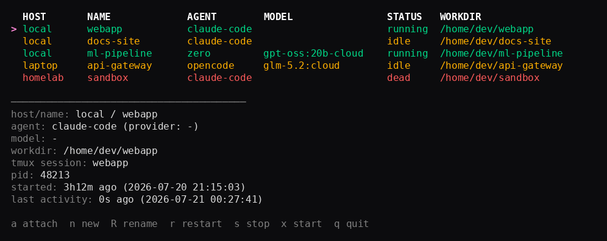
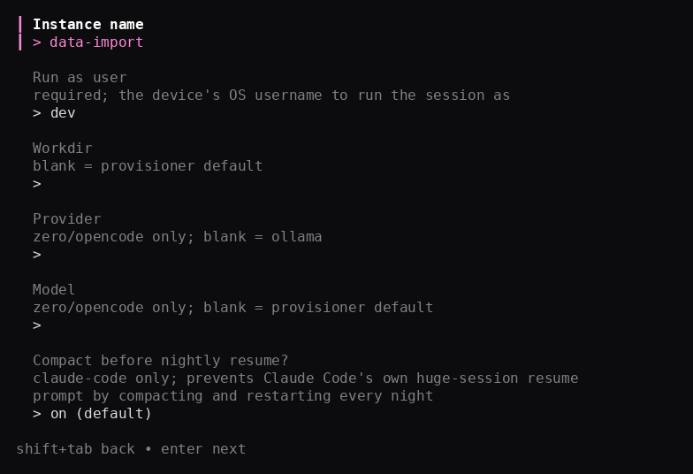

# agentmux daemon + TUI

`agentmux` is a single binary: the TUI by default, plus subcommands to
install its own background daemon and to create new instances. See
[`docs/design/daemon-tui.md`](../docs/design/daemon-tui.md) for the full
design and phased rollout plan.

<p align="center">
  
  
</p>

Phase 1: TUI + daemon talk over a Unix socket on one host — no networking
needed. Phase 2: the daemon can also listen on a TCP address (e.g. a
Tailscale IP), and the TUI can connect to several hosts at once via
`~/.config/agentmux/hosts.yaml`. `agentmux new` — a wizard that creates a
real instance (registry file + systemd unit/LaunchAgent + tmux session) on
any configured device — is native Go end to end (no bash) for every
agent/platform combination this repo supports: `claude-code`, `zero`,
`opencode`, and `kilo`, on both Linux and macOS.

## Build

```sh
go build -o agentmux ./cmd/agentmux
```

The module currently targets Go 1.26.5. The binary orchestrates tools already
installed on the host, so you also need `tmux`, your chosen agent CLI, and the
runtime, credentials, or network access required by your selected provider.
The adapter currently included for `zero`, `opencode`, and `kilo` uses Ollama,
but provider and model are separate provisioning fields.

There's only one binary now — `agentmuxd` was folded into `agentmux daemon
run`.

Regenerate the protobuf/gRPC stubs after editing `proto/agentmuxd.proto`:

```sh
protoc --go_out=internal/pb --go_opt=paths=source_relative \
  --go-grpc_out=internal/pb --go-grpc_opt=paths=source_relative \
  -I proto proto/agentmuxd.proto
```

## Install the daemon

```sh
sudo ./agentmux daemon install     # Linux: root required, installs a systemd unit
./agentmux daemon install          # macOS: do NOT use sudo, installs a per-user LaunchAgent
```

This copies the running binary to a stable path (`/usr/local/bin/agentmux`
on Linux, `~/.agentmux/bin/agentmux` on macOS), installs the unit/plist
pointing at `agentmux daemon run`, and starts it. `agentmux daemon status`
/ `agentmux daemon uninstall` check/remove it. On macOS, re-running `install`
reloads the LaunchAgent and picks up the new binary immediately. On Linux,
systemd's `enable --now` leaves an already-running daemon alone, so follow a
reinstall with `sudo systemctl restart agentmuxd`.

Then, from the same host:

```sh
./agentmux
```

Keys: `↑`/`↓` or `j`/`k` navigate, `a` attaches (detach with `ctrl-\`), `n`
creates an instance, `R` renames, `r`/`s`/`x` restart/stop/start (with `y`
confirmation), `D` configures Discord notifications, and `q` quits.

## Create a new instance

```sh
./agentmux new
```

Prompts for device (any host from `hosts.yaml`, or `local`), agent
(`claude-code`, `zero`, `opencode`, or `kilo`), instance name, run-as user
(Linux only — a macOS instance always runs as whoever ran the wizard),
workdir, and provider/model (zero/opencode/kilo only). Calls the target
device's daemon
over the same connection the TUI uses — creating on a remote device just
means picking it from the same list. If `claude-code` is selected and an
explicit workdir was given, it looks up resumable sessions for that workdir
(via `~/.claude/projects`) and offers a picker instead of asking for a
session ID by hand.

Picking an instance name that's already in use by a *different* agent is
refused rather than silently overwritten — this also catches the case of
an instance installed by the older `backends/*/install.sh` scripts, which
predate the registry file this wizard reads/writes.

On Linux, the workdir must be absolute. The root daemon creates it using the
requested run user's credentials, so normal filesystem permissions decide
where it can live; agentmux does not chown an existing path or create a path
with root's access.

### Scripting: non-interactive create, rename, resume lookup, status, view, and control

```sh
./agentmux new -y -instance myinstance -agent claude-code -run-user ubuntu
./agentmux rename -instance myinstance -tmux-name renamed -display-name "new name"
./agentmux resume-list -workdir /path/to/project -run-user ubuntu
./agentmux list -json
./agentmux control -instance myinstance -action restart
./agentmux view -instance myinstance -lines 50
./agentmux send-keys -instance myinstance Escape
```

`new -y` skips the interactive form and creates directly from flags — same
fields as the form, run `agentmux new -h` for the full list. `rename` is
the CLI counterpart to the TUI's `R` keybinding: a tmux session rename
applies live, a display name change (claude-code only) restarts the
session. That restart uses the resume ID currently saved in the registry, so
use an explicit `new -y -resume ID` when preserving one exact transcript
matters. `resume-list` is the standalone form of the wizard's resume
picker, useful for checking what's resumable before deciding what (if
anything) to pass to `new -y -resume`. `list` is the headless counterpart
to the TUI's instance table (name/agent/model/status/workdir); `-json`
gives a stable, scriptable shape, and `-host all` (the default) merges
every device from `hosts.yaml` into one list. `control` is the CLI
counterpart to the TUI's start/stop/restart keybindings — drive the same
action without attaching a terminal, e.g. after editing an instance's
`AGENTMUX_MODEL` and needing the running session to actually pick it up.
`view`/`send-keys` are the headless counterpart to the TUI's `a` (attach):
`view` prints a read-only snapshot of an instance's tmux pane (`-lines N`
for trailing scrollback), `send-keys` types into it — trailing args are
passed straight through as tmux `send-keys` arguments (literal text and/or
key names like `Escape`, `Enter`, `C-c`). Both resolve the instance's
socket/session the same way Attach does, rather than assuming a socket
naming convention — useful for a script or another agent checking on/
unwedging a session without an interactive terminal. All seven take
`-host` (default `local`, or `all` for `list`) to target any device from
`hosts.yaml`.

## Multiple hosts over Tailscale

On each host you want to control remotely, also bind a TCP listener on its
Tailscale IP (find it with `tailscale ip -4`):

```sh
sudo ./agentmux daemon run -listen 100.x.y.z:4287
```

(or pass `-listen` via the systemd unit's `ExecStart` if installed with
`daemon install` — there's no flag for it yet, so edit
`/etc/systemd/system/agentmuxd.service` and `daemon-reload` for now.)

There's no TLS or authentication on the daemon API yet. The TCP listener
relies entirely on tailnet ACLs, and the local Unix socket is currently mode
`0666`. Any client that can reach either endpoint can list and create
instances, control their lifecycle, read their pane contents, attach, and send
keys. Treat the daemon as a single-user/trusted-admin tool: restrict the TCP
port to fully trusted devices in your Tailscale ACL policy before exposing it,
and don't use the current Linux socket on an untrusted multi-user host.

On the device you run the TUI from, list every host you want to see in
`~/.config/agentmux/hosts.yaml`:

```yaml
hosts:
  - name: local
    address: "unix:///run/agentmux/agentmuxd.sock"
  - name: homelab
    address: "tcp://100.x.y.z:4287"
```

Then just run `./agentmux` (no `-socket` needed once `hosts.yaml` exists —
it's only used as the phase-1 fallback when the file is missing). The TUI
dials every host concurrently and merges them into one table tagged by
host. If a host is unreachable, its row shows an inline error and the TUI
keeps retrying in the background rather than blocking the rest of the
table.

## Checks

```sh
go test ./...
go vet ./...
```

The repository-level `tests/smoke.sh` exercises the installer and session
scripts with fake local tools by default.
